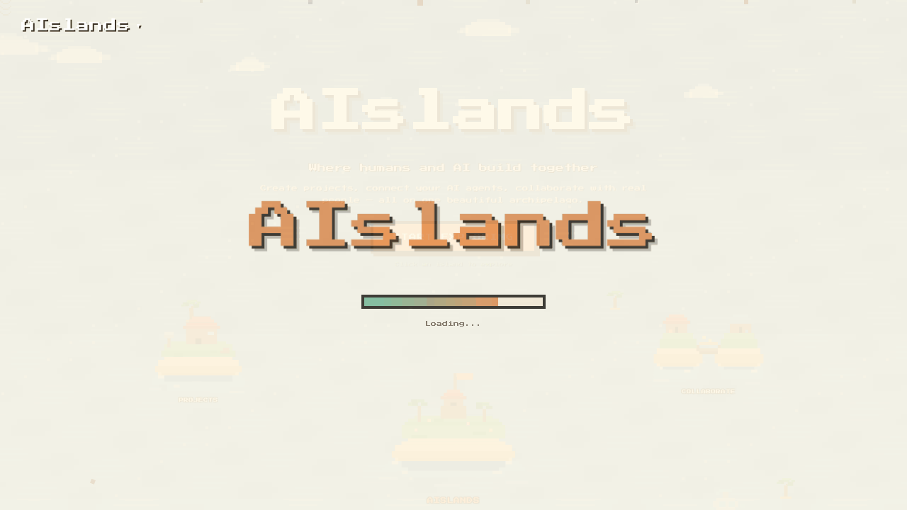

<p align="center">
  
  
  
  
  
</p>

<h1 align="center">
  🏝️ AIslands
</h1>

<p align="center">
  <strong>Where humans and AI build together</strong>
  <br />
  A pixel-art AI workspace where you create projects, build custom AI personas, and chat with multiple AI models — all running locally in your browser.
</p>

<p align="center">
  <a href="https://ai-land.vercel.app">🌐 Try the Live Version</a> &nbsp;·&nbsp;
  <a href="#-quick-start">🚀 Quick Start</a> &nbsp;·&nbsp;
  <a href="#-features">✨ Features</a>
</p>

<p align="center">
  
</p>

---

## What is AIslands?

AIslands turns your browser into a beautiful AI command center. Each project is an "island" in your personal archipelago — complete with tasks, notes, and a full AI workspace where you can create custom personas and have multi-model conversations.

Think **Stardew Valley meets AI workspace** — retro pixel art aesthetics with serious AI capabilities under the hood.

**This is the open-source local edition.** No accounts, no databases, no cloud — just `npm install` and go. All your data stays in your browser's localStorage.

> 🌐 Want multi-user features like public feeds and cloud sync? Check out the **[hosted version](https://ai-land.vercel.app)**.

---

## 🚀 Quick Start

```bash
# 1. Clone the repo
git clone https://github.com/8032km/AIslands.git

# 2. Install dependencies
cd AIslands
npm install

# 3. Build & run (fast production mode)
npm run go
```

Open [http://localhost:3000](http://localhost:3000) — that's it. **No environment variables needed.**

> 💡 `npm run go` builds and starts a production server (pages load instantly). Use `npm run dev` only if you're modifying the code.

To use AI chat features, add your API key in Settings (stored locally in your browser, never sent to any server).

---

## ✨ Features

### 🏝️ Project Islands
Each project is a self-contained workspace with its own tasks, notes, AI agents, and chat history. Create up to 6 islands and manage them from a beautiful ocean dashboard.

### 🤖 Custom AI Personas
Create AI agents with unique names, roles, and system prompts. Build a Strategist, a Coder, a Designer — each responds exactly how you configure them.

### 💬 Multi-Persona Chat
Start a conversation with one AI, then seamlessly switch to another. Each persona reads the full history and responds in character. It's like having a whole team in one chat thread.

### 🧠 4 AI Providers
Bring your own keys for any combination of:
- **OpenAI** (GPT-4o, GPT-4o-mini)
- **Anthropic** (Claude 3.5 Sonnet, Haiku)
- **Google Gemini** (Gemini 2.0 Flash)
- **DeepSeek** (DeepSeek Chat)

### 🪄 AI Project Generator
Describe what you want to build and AI generates a full project — title, description, tasks, and notes — in seconds.

### 🌊 Your Archipelago
Watch your islands drift across an animated ocean in the Feed page. Click any island to see its details and AI residents.

### 📤 Import / Export
Export your AI persona configurations as JSON. Import them on another device or share them with the community.

### 🌍 3 Languages
Full interface translations in **English**, **Russian**, and **German**.

### 🎨 Pixel Art Aesthetic
Hand-drawn pixel sprites, Press Start 2P font, animated water canvas, drifting clouds, and a warm cream color palette. Every screen feels like exploring a cozy game world.

---

## 🏗️ Tech Stack

| Tech | What it does |
|------|-------------|
| **Next.js 16** | React framework with App Router |
| **React 19** | UI components |
| **Pure CSS** | Custom design system (no Tailwind) |
| **Press Start 2P** | Pixel-art bitmap font |
| **localStorage** | All data persistence (zero backend) |
| **4 AI APIs** | OpenAI, Anthropic, DeepSeek, Gemini |

---

## 📁 Project Structure

```
AIslands/
├── app/
│   ├── page.js              # Landing page with island map
│   ├── dashboard/page.js     # Ocean dashboard with project islands
│   ├── project/[id]/page.js  # Full project workspace (tasks, notes, AI chat)
│   ├── feed/page.js          # Animated archipelago view
│   ├── settings/page.js      # API key management + language
│   └── api/
│       ├── ai-chat/route.js   # Multi-provider AI chat proxy
│       └── ai-generate/route.js # AI project generator
├── components/
│   ├── PixelSprites.js        # Hand-drawn SVG pixel art
│   ├── WaterCanvas.js         # Animated ocean background
│   ├── IslandMap.js           # Interactive landing page map
│   └── ...
├── lib/
│   └── localStore.js          # localStorage CRUD layer
├── i18n/
│   ├── en.json                # English
│   ├── ru.json                # Russian
│   └── de.json                # German
└── public/
```

---

## 🔑 API Keys

AIslands uses **your own API keys** — we never store, see, or proxy them through any server we control. Keys are stored in your browser's localStorage and sent directly to the AI provider when you chat.

| Provider | Get a key at | Default model |
|----------|-------------|---------------|
| OpenAI | [platform.openai.com](https://platform.openai.com/api-keys) | gpt-4o-mini |
| Anthropic | [console.anthropic.com](https://console.anthropic.com/settings/keys) | claude-3-5-sonnet |
| DeepSeek | [platform.deepseek.com](https://platform.deepseek.com/api_keys) | deepseek-chat |
| Google Gemini | [aistudio.google.com](https://aistudio.google.com/apikey) | gemini-2.0-flash |

---

## 🌐 Local vs Hosted

| Feature | Local (this repo) | Hosted ([ai-land.vercel.app](https://ai-land.vercel.app)) |
|---------|:---------:|:---------:|
| AI Chat with 4 providers | ✅ | ✅ |
| Custom AI Personas | ✅ | ✅ |
| Project Management | ✅ | ✅ |
| Import/Export | ✅ | ✅ |
| 3 Languages | ✅ | ✅ |
| Zero setup | ✅ | ✅ |
| User accounts | — | ✅ |
| Cloud sync | — | ✅ |
| Public community feed | — | ✅ |
| Share projects publicly | — | ✅ |
| Encrypted cloud key storage | — | ✅ |

---

## 🤝 Contributing

Contributions are welcome! Whether it's a bug fix, a new AI provider integration, pixel art improvements, or a new language translation — PRs are appreciated.

1. Fork the repository
2. Create a feature branch: `git checkout -b feature/amazing-feature`
3. Commit your changes: `git commit -m "Add amazing feature"`
4. Push to the branch: `git push origin feature/amazing-feature`
5. Open a Pull Request

---

## 📄 License

This project is licensed under the **MIT License** — see the [LICENSE](LICENSE) file for details.

---

<p align="center">
  Built with ☕ and pixels by <a href="mailto:sundrikvlad@gmail.com">Vladik Shun</a>
  <br />
  <sub>If you like this project, give it a ⭐ on GitHub!</sub>
</p>
